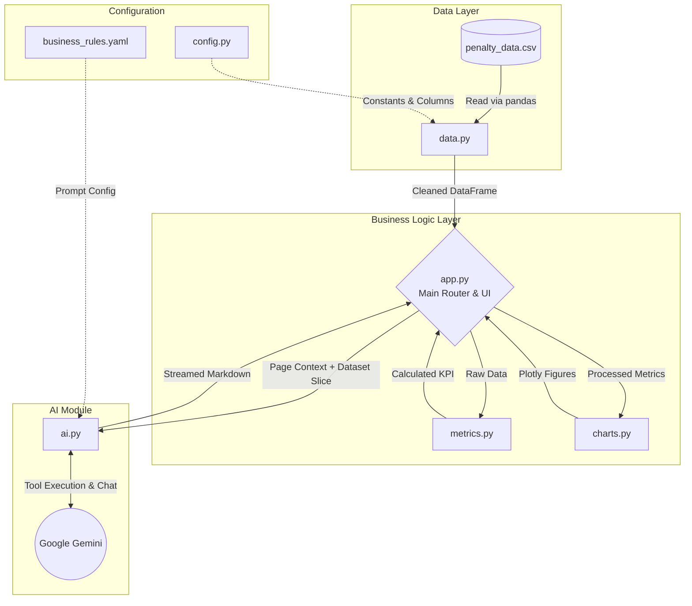

# AGEL – Solar/Wind Power Forecasting Performance Overview

> A high-performance Streamlit application designed for comparative analysis of forecasting penalties across different regions, energy agencies, and power plant types.

The tool visualizes energy capacity (AVC), calculates simple and weighted average penalties, and integrates Google's **Gemini LLM** to generate actionable, data-driven domain insights directly within the dashboard.

---

## System Architecture

The project is structured in a modular backend/frontend architecture specifically tuned for Streamlit's reactive rendering model.

---

## Module Breakdown

### 1. `config.py` & `config/business_rules.yaml`

Acts as the central configuration hub.

- **`config.py`:** Dynamically parses CSV headers to identify available month columns, sets AGEL corporate design colors, application metadata, and manages categorical options.
- **`business_rules.yaml`:** Used exclusively by the AI module to dictate analytical prioritization (e.g., grading STOA vs LTA impact) and enforce the LLM's output response contract.

### 2. `data.py`

Handles all data ingress and preprocessing.

- **Transformations:** Drops unmapped columns, forces correct data types, removes unneeded Year-To-Date (YTD) aggregates, and provides helper functions to filter the long/wide datasets via Pandas logic.

### 3. `metrics.py`

Separates mathematical business logic from UI rendering.

- Calculations include AVC-weighted penalties, dimensional aggregations, agency breakdowns, and time-series trends. Modularizing this keeps `app.py` lightweight and testable.

### 4. `charts.py`

Wraps `plotly.express` and `plotly.graph_objects`.

- Consumes aggregated dataframes from `metrics.py` and returns fully styled, interactive Plotly charts adhering to the AGEL corporate design system defined in `config.py`.

### 5. `ai.py` *(Low-Latency & Context-Aware AI Engine)*

The core AI orchestration engine integrating Google Gemini.

- **Context-Aware LLMs:** Dynamically generates targeted initial/follow-up questions by accepting a `page_context` string (e.g., Home vs. Khavda vs. User Deep Dive), ensuring the AI never confuses an isolated subset for the whole portfolio.
- **Python Sandbox Tools:** Implements a restricted python sandbox as a tool, allowing the LLM to run dynamic Pandas code against the actual data to return mathematically proven insights.
- **Low-Latency Streaming:**
  - Uses `@st.cache_data` to aggressively cache `business_rules.yaml` disk I/O and prevent dynamic compiling of heavy YAML prompt strings.
  - Uses `@st.cache_resource` for global API Thread Pooling, ensuring persistent TCP/SSL connections to Google's servers are reused across all user sessions simultaneously.

### 6. `app.py`

The main Streamlit orchestrator.

- Renders the UI layout, sidebars, metrics cards, and plots by stitching together all independent modules.
- Uses independent `chat_history_{page_id}` dictionary keys embedded in `st.session_state` to permanently separate user chat histories per page.
- Implements `@st.fragment` routing and background threading (`_ai_background_worker`) for the chat UI to prevent full-page lag and locking when querying Gemini.

---

## Rendering Flow

1. Streamlit boots `app.py`.
2. `config.py` resolves dynamic month headers based on the current data schema.
3. `data.py` loads and caches the raw CSV into Pandas memory.
4. User selects an analysis scope (e.g., "Home", "Khavda Deep Dive"). `app.py` executes data filtering mechanisms.
5. `app.py` passes filtered data to `metrics.py` and `charts.py` to draw the fast-loading dashboard.
6. The user scrolls to the **AI Assistant**. `app.py` spawns a non-blocking background thread communicating directly with `ai.py`, injecting the specific context string, avoiding complete UI re-renders thanks to Streaming execution mapping.
